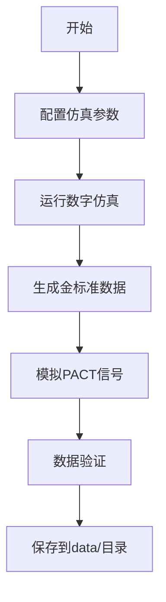

# 项目结构说明文档
# Project Structure Documentation

## 目录结构图

```
PAT-PACT-Project/
│
├── 📁 data/                           # 数据目录
│   ├── raw/                           # 原始数据
│   ├── processed/                     # 预处理后的数据
│   ├── gold_standard/                 # 金标准数据（Ground Truth）
│   └── simulation/                    # 数字仿真生成的数据
│
├── 📁 simulation/                     # 任务1：数字仿真模块
│   ├── models/                        # 仿真模型定义
│   │   ├── optical_model.py          # 光学传播模型
│   │   ├── acoustic_model.py         # 声学传播模型
│   │   └── tissue_model.py           # 组织模型
│   ├── scripts/                       # 仿真执行脚本
│   │   ├── generate_gold_standard.py # 生成金标准
│   │   ├── simulate_pact_signal.py   # 模拟PACT信号
│   │   └── run_batch_simulation.py   # 批量仿真
│   ├── configs/                       # 仿真配置
│   │   ├── simulation_params.yaml    # 仿真参数
│   │   └── tissue_properties.yaml    # 组织光学参数
│   └── results/                       # 仿真输出结果
│
├── 📁 reconstruction/                 # 任务2.1：图像重建模块
│   ├── models/                        # 重建网络模型
│   │   ├── unet_reconstruction.py    # U-Net重建网络
│   │   ├── custom_layers.py          # 自定义网络层
│   │   └── loss_functions.py         # 损失函数
│   ├── scripts/                       # 训练和推理脚本
│   │   ├── train.py                  # 训练脚本
│   │   ├── inference.py              # 推理脚本
│   │   ├── validate.py               # 验证脚本
│   │   └── data_loader.py            # 数据加载器
│   ├── configs/                       # 配置文件
│   │   ├── network_config.yaml       # 网络配置
│   │   └── training_config.yaml      # 训练配置
│   ├── checkpoints/                   # 模型权重
│   │   ├── best_model.pth            # 最佳模型
│   │   └── epoch_*.pth               # 各轮次检查点
│   └── results/                       # 重建结果
│       ├── reconstructed_images/     # 重建图像
│       └── metrics/                  # 评估指标
│
├── 📁 segmentation/                   # 任务2.2：分割网络模块
│   ├── models/                        # 分割网络模型
│   │   ├── unet_segmentation.py      # U-Net分割网络
│   │   ├── attention_unet.py         # 注意力U-Net
│   │   └── loss_functions.py         # 分割损失函数
│   ├── scripts/                       # 训练和推理脚本
│   │   ├── train.py                  # 训练脚本
│   │   ├── inference.py              # 推理脚本
│   │   ├── postprocess.py            # 后处理
│   │   └── data_augmentation.py      # 数据增强
│   ├── configs/                       # 配置文件
│   │   ├── model_config.yaml         # 模型配置
│   │   └── augmentation_config.yaml  # 数据增强配置
│   ├── checkpoints/                   # 模型权重
│   └── results/                       # 分割结果
│       ├── segmentation_masks/       # 分割掩码
│       └── performance_metrics/      # 性能指标
│
├── 📁 evaluation/                     # 任务3：评估与分析模块
│   ├── metrics/                       # 评估指标
│   │   ├── dice_coefficient.py       # Dice系数
│   │   ├── iou.py                    # IoU计算
│   │   ├── hausdorff_distance.py     # Hausdorff距离
│   │   └── volume_metrics.py         # 体积测量
│   ├── scripts/                       # 评估脚本
│   │   ├── pipeline.py               # 端到端流水线
│   │   ├── batch_evaluation.py       # 批量评估
│   │   └── statistical_analysis.py   # 统计分析
│   ├── results/                       # 评估结果
│   │   ├── quantitative_results/     # 量化结果
│   │   └── comparison_tables/        # 对比表格
│   └── visualizations/                # 可视化
│       ├── segmentation_overlay/     # 分割叠加图
│       └── performance_plots/        # 性能曲线
│
├── 📁 docs/                           # 文档
│   ├── reports/                       # 项目报告
│   │   ├── phase1_report.md          # 第一阶段报告
│   │   ├── final_report.md           # 最终报告
│   │   └── experiment_records.md     # 实验记录
│   ├── presentations/                 # 演示文稿
│   │   ├── midterm_presentation.pdf  # 中期汇报
│   │   └── final_presentation.pdf    # 最终答辩
│   └── papers/                        # 参考文献
│       └── references.bib            # 文献引用
│
├── 📁 notebooks/                      # Jupyter笔记本
│   ├── 01_data_exploration.ipynb     # 数据探索
│   ├── 02_simulation_demo.ipynb      # 仿真演示
│   ├── 03_reconstruction_exp.ipynb   # 重建实验
│   ├── 04_segmentation_analysis.ipynb# 分割分析
│   └── 05_results_visualization.ipynb# 结果可视化
│
├── 📁 utils/                          # 通用工具
│   ├── data_utils.py                 # 数据处理工具
│   ├── visualization.py              # 可视化工具
│   ├── metrics.py                    # 评估指标工具
│   ├── logger.py                     # 日志工具
│   └── config_parser.py              # 配置解析器
│
├── 📁 tests/                          # 测试
│   ├── test_simulation.py            # 仿真模块测试
│   ├── test_reconstruction.py        # 重建模块测试
│   ├── test_segmentation.py          # 分割模块测试
│   ├── test_evaluation.py            # 评估模块测试
│   └── test_utils.py                 # 工具函数测试
│
├── 📁 configs/                        # 全局配置
│   ├── global_config.yaml            # 全局配置
│   └── paths.yaml                    # 路径配置
│
├── 📁 outputs/                        # 输出文件
│   ├── figures/                      # 生成的图表
│   └── logs/                         # 日志文件
│
├── .gitignore                        # Git忽略文件
├── requirements.txt                  # Python依赖
└── README.md                         # 项目说明

```

## 工作流程

### Phase 1: 数据构建 (Weeks 1-2.5)



### Phase 2: 模型训练

#### 2.1 重建网络
```
仿真PACT信号 → 重建网络训练 → 重建图像输出
```

#### 2.2 分割网络
```
重建图像 → 分割网络训练 → 半暗带分割结果
```

### Phase 3: 系统整合

```
端到端流水线：
PACT信号 → 重建模块 → 分割模块 → 评估模块 → 量化结果
```

## 数据流动

```
simulation/results/
    ↓
data/simulation/
    ↓
reconstruction/scripts/train.py
    ↓
reconstruction/results/
    ↓
segmentation/scripts/train.py
    ↓
segmentation/results/
    ↓
evaluation/scripts/pipeline.py
    ↓
evaluation/results/ + evaluation/visualizations/
    ↓
docs/reports/
```

## 模块间依赖关系

1. **simulation** → 独立模块，生成数据
2. **reconstruction** → 依赖simulation生成的数据
3. **segmentation** → 依赖reconstruction的输出
4. **evaluation** → 整合所有模块，依赖gold_standard

## 最佳实践

### 1. 版本控制
- 重要的模型权重使用版本命名：`model_v1.0.pth`
- 配置文件记录实验参数
- 使用Git标签标记重要里程碑

### 2. 数据管理
- 原始数据保持不变，存储在`data/raw/`
- 所有处理步骤生成新数据，保存在`data/processed/`
- 金标准数据单独管理，便于评估

### 3. 实验记录
- 在notebooks/中记录探索性实验
- 在docs/reports/中记录正式实验结果
- 使用配置文件而非硬编码参数

### 4. 代码组织
- 模型定义与训练脚本分离
- 可复用的代码放入utils/
- 保持各模块的独立性

### 5. 结果管理
- 使用时间戳命名输出文件
- 重要结果复制到outputs/figures/用于报告
- 定期清理临时文件

## 文件命名约定

- 脚本文件：`verb_noun.py` (如：`train_model.py`)
- 配置文件：`module_config.yaml` (如：`reconstruction_config.yaml`)
- 数据文件：`YYYYMMDD_description.ext` (如：`20231115_simulation_data.npy`)
- 模型文件：`model_version_epoch.pth` (如：`unet_v1.0_epoch50.pth`)

## 下一步工作

1. ✅ 创建项目目录结构
2. ⬜ 设置Python虚拟环境
3. ⬜ 安装依赖包
4. ⬜ 实现仿真模块
5. ⬜ 构建数据集
6. ⬜ 设计重建网络
7. ⬜ 设计分割网络
8. ⬜ 实现评估流水线
9. ⬜ 撰写报告和PPT

---

最后更新：2025-11-11
